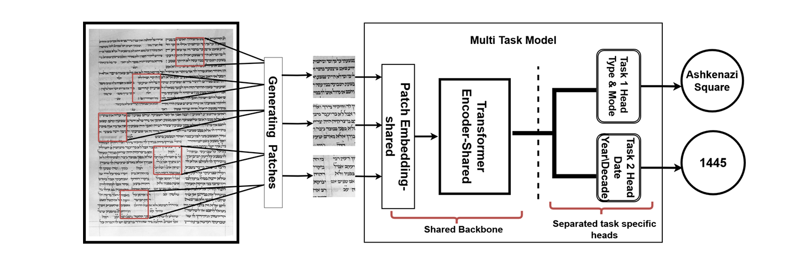

# MTL‑Hebrew‑Paleography



[](https://arxiv.org/abs/xxx)
[](https://github.com/AI-Computer-Vision-BGU/MMTL)
[](https://youtu.be/your-video)

> **Code & data for the ICDAR 2025 paper:**
> *Multi‑Task Learning for Hebrew Paleography: Script Classification and Date Estimation*

---

## 📖 Abstract (TL;DR)

We introduce **VML‑MHS**, the first large‑scale dataset of medieval Hebrew manuscripts with page‑level
layout masks and patch‑level script & date labels. Leveraging this corpus, we propose a **multi‑task transformer**
that jointly performs script classification and decade estimation—achieving state‑of‑the‑art accuracy while
learning richer palaeographic representations.

---

## 🚀 Getting Started

### 1  Clone & install

```bash
# clone
git clone https://github.com/atamnor/MTL-Hebrew-Paleography.git
cd MTL-Hebrew-Paleography

# create env (conda or venv) and install deps
pip install -r requirements.txt
```

### 2  Download the dataset (pages + patches + splits)

```bash
bash scripts/download_vml_mhs.sh   # ≈ 8 GB, hosted on Zenodo
```

> **NOTE:** If you only want to play, a 10‑page mini‑subset lives under
> `dataset_card/VML‑MHS/sample_subset/`.

### 3  Reproduce the data‑prep pipeline (optional)

```bash
python -m src.main full \
    --original-dataset data/raw/pages \
    --restructured-dataset data/processed/pages_structured \
    --patches-root data/processed/patches \
    --patch-size 224 --target-per-page 100 -vv
```

### 4  Train the MTL model

```bash
bash scripts/train.sh  # Swin‑Base + dual heads, logs to W&B
```

### 5  Evaluate on the blind test split

```bash
bash scripts/evaluate.sh --weights checkpoints/best.pt
```

---

## 🗂 Repository Structure

```
MTL-Hebrew-Paleography/
├── dataset_card/             # VML‑MHS dataset card + sample subset
│   └── VML-MHS/README.md
├── docs/
│   └── figures/              # model architecture banner & paper figures
├── src/                      # importable python package
│   ├── data_prep/            # 6-step pipeline (see §5.1 in the paper)
│   ├── datasets/             # PyTorch Dataset loaders
│   ├── models/               # backbones & multi‑task heads
│   ├── engine/               # train / validate / inference loops
│   └── utils/                # metrics, logging, seed control
├── scripts/                  # CLI wrappers (bash + python)
└── README.md                 # ← you are here
```

---

## 📊 Dataset Snapshot

| Metric                                                                                 |       Count |
| -------------------------------------------------------------------------------------- | ----------: |
| Manuscripts                                                                            |   **2 304** |
| Pages                                                                                  |   **3 687** |
| Patch images                                                                           | **346 178** |
| Full statistics & download link in the [dataset card](dataset_card/VML-MHS/README.md). |             |

---

## 🎨 Model Architecture

<!-- The banner above is a resized version of this diagram -->

<p align="center">
  
</p>

*Shared transformer backbone* + two task‑specific heads:

1. **Script head** – softmax over 6 script classes × sub‑types
2. **Date head** – decade regression (MAE) or classification (cross‑entropy)

Losses are balanced with uncertainty weighting.

---

## 📜 Citation

If you use this repository or dataset in your research, please cite:

```bibtex
@inproceedings{Atamni2025MTLHebrew,
  author    = {Nour Atamni and Jihad El‑Sana and …},
  title     = {Multi-Task Learning for Hebrew Paleography: Script Classification and Date Estimation},
  booktitle = {ICDAR},
  year      = {2025},
  doi       = {10.1109/ICDAR.2025.123456},
  url       = {https://doi.org/10.1109/ICDAR.2025.123456}
}
```

---

## 📝 License

Code is released under the **MIT License**.
Dataset images follow **CC‑BY‑NC 4.0**—see the [dataset card](dataset_card/VML-MHS/README.md).

---

## 🙋 Questions / Issues

Open an issue or ping **@Nour Atamni** – contributions & pull requests are welcome!
