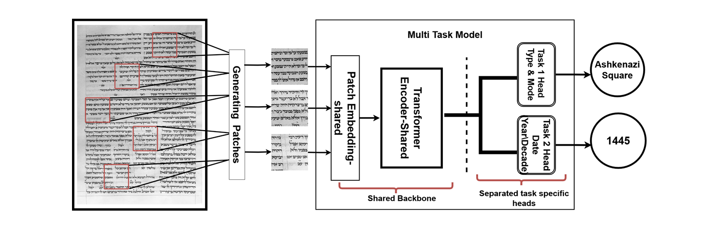

# MTL-Hebrew-Paleography

[![Paper][paper-badge]][paper-pdf]
[![Dataset][dataset-badge]][dataset-drive]
[![Code][code-badge]][repo-link]

Official implementation of the ICDAR 2025 paper:

**Multi-task Learning for Hebrew Paleography: Script Classification and Date Estimation**

<p align="center">
  
</p>

---

## Overview

This repository contains the code for a multi-task learning framework for medieval Hebrew manuscript analysis.

The model jointly performs two tasks:

1. **Script classification** — predicting Hebrew script type and script mode.
2. **Date estimation** — estimating the manuscript production date.

The framework uses a shared visual backbone with task-specific heads for script classification and date estimation.

---

## Paper and Dataset

- **Paper PDF:** [Multi-task Learning for Hebrew Paleography: Script Classification and Date Estimation][paper-pdf]
- **Dataset:** [VML-MHS Dataset - Google Drive][dataset-drive]

---

## Dataset

The project uses the **VML-MHS** dataset.

- [Dataset Download - Google Drive][dataset-drive]
- [Dataset Card](dataset_card/README.md)

| Item | Count |
|---|---:|
| Manuscripts | 2,304 |
| Pages | 3,687 |
| Patches | 346k+ |
| Time span | 850–1540 CE |

<p align="center">
  
</p>

---
## Model Architecture

The proposed model follows a multi-task learning design with a shared visual backbone and two task-specific heads.


The architecture contains:

- A shared visual backbone.
- A script classification head.
- A date estimation head.

The experiments include several vision backbones:

- ViT
- Swin Transformer
- MobileViT
- FocalNet
- BEiT
- ConvNeXT

---

## Repository Structure

```text
MTL-Hebrew-Paleography/
├── README.md
├── requirements.txt
├── .gitignore
├── LICENSE
├── CITATION.cff
│
├── docs/
│   └── figures/
│       ├── mtl_architecture_banner.png
│       └── mtl_architecture_full.png
│
├── src/
│   ├── HebrewPaleopraphyLoader.py
│   ├── MultiTaskModel.py
│   ├── ModelsConfigsNew.py
│   ├── train.py
│   ├── evaluate_patch_level.py
│   ├── evaluate_page_level.py
│   ├── predict.py
│   └── extract_page_patches.py
│
└── scripts/
    └── data_preparation/
        ├── Step1_CreatDataset.py
        ├── Step2_AnalysisOriginalDataset.py
        ├── Step3_ExtractPatches.py
        ├── Step4_AnalysisPatchesDataset.py
        ├── Step5_GroupDatasetToDecades.py
        └── Step6_WithBlindTest.py
```

---

## Installation

Clone the repository:

```bash
git clone https://github.com/atamnour/MTL-Hebrew-Paleography.git
cd MTL-Hebrew-Paleography
```

Install the required packages:

```bash
pip install -r requirements.txt
```

---

## Data Preparation

The data preparation scripts are located under:

```text
scripts/data_preparation/
```

The preprocessing pipeline includes:

```bash
python scripts/data_preparation/Step1_CreatDataset.py
python scripts/data_preparation/Step2_AnalysisOriginalDataset.py
python scripts/data_preparation/Step3_ExtractPatches.py
python scripts/data_preparation/Step4_AnalysisPatchesDataset.py
python scripts/data_preparation/Step5_GroupDatasetToDecades.py
python scripts/data_preparation/Step6_WithBlindTest.py
```

Before running the scripts, update the dataset paths inside each file according to your local setup.

---

## Training

The main training script is:

```bash
python src/train.py
```

Main training components:

```text
src/train.py
src/HebrewPaleopraphyLoader.py
src/MultiTaskModel.py
src/ModelsConfigsNew.py
```

Before training, update the dataset JSON path and output directory inside `src/train.py`.

---

## Evaluation

Patch-level evaluation:

```bash
python src/evaluate_patch_level.py
```

Page-level evaluation:

```bash
python src/evaluate_page_level.py
```

Single image prediction:

```bash
python src/predict.py
```

Before running evaluation or prediction, update the checkpoint path and dataset paths inside the relevant script.

---

## Citation

If you use this repository or dataset, please cite:

```bibtex
@inproceedings{atamni2025multi,
  title={Multi-task Learning for Hebrew Paleography: Script Classification and Date Estimation},
  author={Atamni, Nour and Madi, Boraq and Bordman, Shoshana and Shapira, Daria Vasyutinsky and Rabaev, Irina and El-Sana, Jihad},
  booktitle={International Conference on Document Analysis and Recognition},
  pages={79--97},
  year={2025},
  organization={Springer}
}
```

---

## Contact

For questions, please open an issue in this repository.

---

[paper-badge]: https://img.shields.io/badge/Paper-PDF-blue.svg
[dataset-badge]: https://img.shields.io/badge/Dataset-Google%20Drive-green.svg
[code-badge]: https://img.shields.io/badge/Code-GitHub-black?logo=github

[paper-pdf]: https://d1wqtxts1xzle7.cloudfront.net/125681828/978_3_032_04630_7_5-libre.pdf?1765299456=&response-content-disposition=inline%3B+filename%3DMulti_task_Learning_for_Hebrew_Paleograp.pdf&Expires=1779407119&Signature=XYIcFv75ax7zJ7Fl3wbVHDpIlTXN8VYH5KRRptVZW2xpEB8wUlb3BgGIENNpZYBBxX0H3gxT5wZwec~WTxNZV~1u8yfDAhZERoima93nhqCd5DZbv6r36aOvEo3AJYn16NVpYXuRDN9qsfyeU2gtsXu~e55LOAKbCbAOM9gefzGE4YRqVMtpx60~4rs4kbbT78fx9Y~2haFWfDbFFDqO1qVlfkmKL0O3KDtx8DdSUjOVggPbYSQsTOXSGpARQRVHURYJEGMCgzxxSZ3-5XCbRhYHOcyMmbdhy~MT6EkwLMMHst8-o8nDiUqtrusgL3OWnENdvmZLVKWRQsmk~oULpA__&Key-Pair-Id=APKAJLOHF5GGSLRBV4ZA
[dataset-drive]: https://drive.google.com/drive/folders/1goFULTOaANfCDzdk5p2jWa1sJoKnICiu?usp=sharing
[repo-link]: https://github.com/atamnour/MTL-Hebrew-Paleography