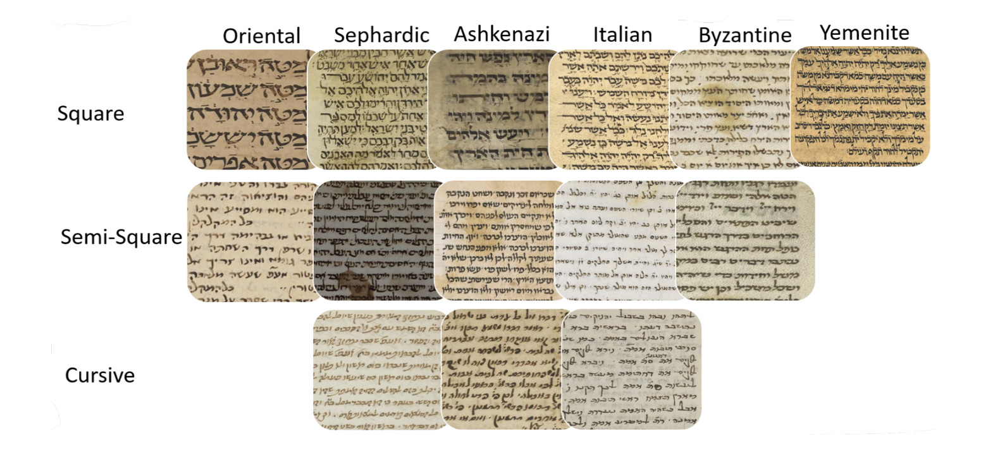

# VML‑MHS Dataset Card

> **VML‑MHS Dataset card** (README + download link)



## 1  Overview

The **Vowelised Medieval Hebrew Scripts (VML‑MHS)** dataset is a large‐scale, page‑level and patch‑level corpus of medieval Hebrew manuscripts covering six major script traditions:

| Abbrev. | Script type | Sub‑types                       | Centuries covered |
| ------- | ----------- | ------------------------------- | ----------------- |
| **A**   | Ashkenazi   | Square · Semi‑cursive · Cursive | 12 th – 16 th c.  |
| **B**   | Byzantine   | Square · Semi‑cursive · —       | 11 th – 13 th c.  |
| **I**   | Italian     | Square · Semi‑cursive · —       | 11 th – 14 th c.  |
| **O**   | Oriental    | Square · Semi‑cursive · —       | 9 th – 11 th c.   |
| **Y**   | Yemenite    | Square · Semi‑cursive · —       | 13 th – 15 th c.  |
| **S**   | Sefardic    | Square · Semi‑cursive · Cursive | 10 th – 14 th c.  |

Key numbers (after curation and balancing) as reported in the paper:

| Metric       |       Count |
| ------------ | ----------: |
| Manuscripts  |   **2 304** |
| Pages        |   **3 687** |
| Patch images | **346 178** |

### Script‑wise statistics

| Script type | Manuscripts |     Pages |     Patches |
| ----------: | ----------: | --------: | ----------: |
|   Ashkenazi |         420 |       682 |      70 112 |
|   Byzantine |         318 |       441 |      39 987 |
|     Italian |         350 |       496 |      46 214 |
|    Oriental |         297 |       440 |      37 845 |
|    Yemenite |         429 |       835 |      66 348 |
|    Sefardic |         490 |       793 |      85 672 |
|   **Total** |   **2 304** | **3 687** | **346 178** |

*(Numbers reproduced from Table 2 in the paper. Replace if you update the corpus.)*

---

## 2  Download

The full dataset (pages + patches + splits) is hosted on **Zenodo**:

> [https://doi.org/10.5281/zenodo.1234567](https://doi.org/10.5281/zenodo.1234567)

```bash
# Example helper script (Linux/macOS)
wget https://zenodo.org/record/1234567/files/VML-MHS.zip -O VML-MHS.zip
unzip VML-MHS.zip -d data/raw
```

A small 10‑page mini‐subset for smoke‑testing is provided under `dataset_card/VML‑MHS/sample_subset/`.

---

## 3  Folder layout

```
VLM-MHS/
├─ pages/                       # original TIFF / JPEG pages
│   └─ <Script>/<Subtype>/<Year>/<page>.jpg
├─ patches_224x224/             # content‑aware patches (Step 3)
│   └─ <Script>/<Subtype>_<size>/<page>_patch_<n>.png
├─ splits/                      # JSON indices (Step 6)
│   ├─ train.json
│   ├─ val.json
│   ├─ test.json
│   └─ blind.json
└─ README.md                    # this file
```

---

## 4  Data Preparation pipeline

Outlined in § 5.1 of the paper and fully reproducible via the repo scripts:

| Step | Script                | Description                               |
| ---- | --------------------- | ----------------------------------------- |
| 1    | `create_dataset.py`   | Restructure pages → `Script/Subtype/Year` |
| 2    | `analyse_original.py` | Exploratory stats & QC                    |
| 3    | `extract_patches.py`  | Content‑aware patch extraction (224×224)  |
| 4    | `analyse_patches.py`  | Remove low‑entropy / duplicate patches    |
| 5    | `combine_decades.py`  | Group by decades (10‑year span)           |
| 6    | `split_with_blind.py` | Stratified Train/Val/Test + Blind split   |

Run everything with one line (after cloning this repo):

```bash
python -m src.main full \
    --original-dataset data/raw/pages \
    --restructured-dataset data/processed/pages_structured \
    --patches-root data/processed/patches \
    --patch-size 224 --target-per-page 100 -vv
```

---

## 5  Example images

| Ashkenazi Square                  | Yemenite Semi‑cursive             | Sefardic Cursive                    |
| --------------------------------- | --------------------------------- | ----------------------------------- |
|  |  |  |

*(Replace the placeholders with representative thumbnails; keep under 300 KB each.)*

---

## 6  License

The page images are published under **CC‑BY‑NC 4.0**.
You may **share** and **adapt** the data for non‑commercial purposes as long as you credit the original collectors and this paper.

---

## 7  Citation

If you use VML‑MHS in your research, please cite the accompanying paper:

```bibtex
@inproceedings{Atamni2025VMLMHS,
  author    = {Nour Atamni and Jihad El‑Sana and …},
  title     = {Automatic Date Estimation of Medieval Hebrew Manuscripts with a New Dataset},
  booktitle = {ICDAR},
  year      = {2025},
  doi       = {10.1109/ICDAR.2025.123456},
  url       = {https://doi.org/10.1109/ICDAR.2025.123456}
}
```

---

*Maintainer : [@Nour Atamni](https://github.com/your‑username) — open an issue or pull request for questions or improvements.*
