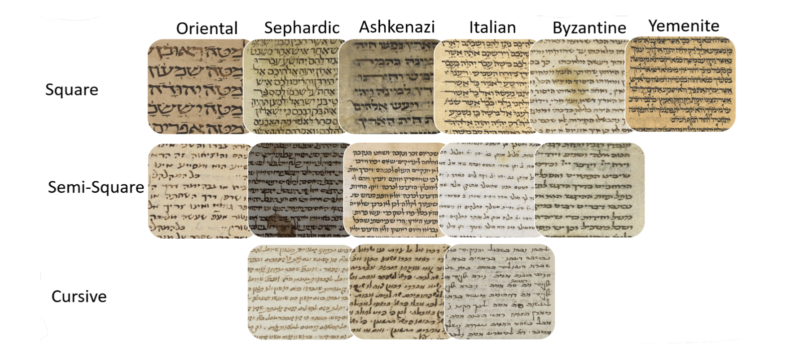

# VML-MHS Dataset Card

[](https://drive.google.com/drive/folders/1goFULTOaANfCDzdk5p2jWa1sJoKnICiu?usp=sharing)
[](https://d1wqtxts1xzle7.cloudfront.net/125681828/978_3_032_04630_7_5-libre.pdf?1765299456=&response-content-disposition=inline%3B+filename%3DMulti_task_Learning_for_Hebrew_Paleograp.pdf&Expires=1779407119&Signature=XYIcFv75ax7zJ7Fl3wbVHDpIlTXN8VYH5KRRptVZW2xpEB8wUlb3BgGIENNpZYBBxX0H3gxT5wZwec~WTxNZV~1u8yfDAhZERoima93nhqCd5DZbv6r36aOvEo3AJYn16NVpYXuRDN9qsfyeU2gtsXu~e55LOAKbCbAOM9gefzGE4YRqVMtpx60~4rs4kbbT78fx9Y~2haFWfDbFFDqO1qVlfkmKL0O3KDtx8DdSUjOVggPbYSQsTOXSGpARQRVHURYJEGMCgzxxSZ3-5XCbRhYHOcyMmbdhy~MT6EkwLMMHst8-o8nDiUqtrusgL3OWnENdvmZLVKWRQsmk~oULpA__&Key-Pair-Id=APKAJLOHF5GGSLRBV4ZA)

Dataset card for **VML-MHS**: Visual Media Lab - Medieval Hebrew Sfardata.

This dataset accompanies the ICDAR 2025 paper:

**Multi-task Learning for Hebrew Paleography: Script Classification and Date Estimation**

---

## Overview

VML-MHS is a medieval Hebrew manuscript dataset designed for computational paleography.

Each manuscript page is annotated with:

- Script type
- Script mode
- Production year

The dataset supports two main tasks:

1. Hebrew script type and mode classification.
2. Manuscript date estimation.

---

## Download

The dataset is available on Google Drive:

[VML-MHS Dataset - Google Drive](https://drive.google.com/drive/folders/1goFULTOaANfCDzdk5p2jWa1sJoKnICiu?usp=sharing)

After downloading the dataset, update the local paths inside the training, evaluation, and data preparation scripts.

---

## Dataset Summary

| Item | Count |
|---|---:|
| Manuscripts | 2,304 |
| Pages | 3,687 |
| Patch images | 346k+ |
| Time span | 850–1540 CE |
| Main script types | 6 |
| Script modes | Square, Semi-cursive, Cursive |

The six main script types are:

- Ashkenazi
- Byzantine
- Italian
- Oriental
- Sephardic
- Yemenite

---

## Example Images

The following examples show representative patches from different Hebrew script types and modes in the VML-MHS dataset.

<p align="center">
  
</p>

---

## Annotation Format

Each manuscript is organized using the following metadata:

```text
Script Type / Script Mode / Year
```

Example:

```text
Ashkenazi / Square / 1540
```

This structure allows the dataset to be used for both script classification and date estimation.

---

## Data Preparation Pipeline

The repository includes the original data preparation scripts under:

```text
scripts/data_preparation/
```

The pipeline includes:

| Step | Script | Purpose |
|---:|---|---|
| 1 | `Step1_CreatDataset.py` | Restructure manuscript pages by script type, mode, and year |
| 2 | `Step2_AnalysisOriginalDataset.py` | Analyze the original page-level dataset |
| 3 | `Step3_ExtractPatches.py` | Extract patch images from manuscript pages |
| 4 | `Step4_AnalysisPatchesDataset.py` | Analyze extracted patches and dataset quality |
| 5 | `Step5_GroupDatasetToDecades.py` | Group years into temporal classes |
| 6 | `Step6_WithBlindTest.py` | Create train, test, and blind-test splits |

Run each step manually after updating the paths inside the scripts.

---

## Expected Folder Structure

The exact local structure may depend on how the dataset is downloaded and prepared, but the scripts assume a structure similar to:

```text
VML-MHS/
├── pages/
│   └── <ScriptType>/<ScriptMode>/<Year>/<page_image>
│
├── patches/
│   └── <ScriptType>/<ScriptMode>/<Year>/<patch_image>
│
└── splits_or_json/
    └── <dataset_json_files>
```

Before training, make sure the dataset JSON path inside `src/train.py` points to the correct file.

---

## Notes

- Dataset paths are not hard-coded here because local storage layouts may differ.
- The current scripts require updating paths manually before running.
- Do not commit the full dataset to GitHub.
- Use the Google Drive link above for dataset access.

---

## Citation

If you use this dataset or repository, please cite:

```bibtex
@inproceedings{atamni2025multi,
  title={Multi-task Learning for Hebrew Paleography: Script Classification and Date Estimation},
  author={Atamni, Nour and Madi, Boraq and Bordman, Shoshana and Shapira, Daria Vasyutinsky and Rabaev, Irina and El-Sana, Jihad},
  booktitle={International Conference on Document Analysis and Recognition},
  pages={79--97},
  year={2025},
  organization={Springer}
}
```

---

## Contact

For questions, please open an issue in the main repository.

<!-- # VML‑MHS Dataset Card

> **VML‑MHS Dataset card** (README + download link)


## 1  Overview

The **Vowelised Medieval Hebrew Scripts (VML‑MHS)** dataset is a large‐scale, page‑level and patch‑level corpus of medieval Hebrew manuscripts covering six major script traditions:

| Abbrev. | Script type | Sub‑types                       | Centuries covered |
| ------- | ----------- | ------------------------------- | ----------------- |
| **A**   | Ashkenazi   | Square · Semi‑cursive · Cursive | 12 th – 16 th c.  |
| **B**   | Byzantine   | Square · Semi‑cursive · —       | 11 th – 13 th c.  |
| **I**   | Italian     | Square · Semi‑cursive · —       | 11 th – 14 th c.  |
| **O**   | Oriental    | Square · Semi‑cursive · —       | 9 th – 11 th c.   |
| **Y**   | Yemenite    | Square · Semi‑cursive · —       | 13 th – 15 th c.  |
| **S**   | Sefardic    | Square · Semi‑cursive · Cursive | 10 th – 14 th c.  |

Key numbers (after curation and balancing) as reported in the paper:

| Metric       |       Count |
| ------------ | ----------: |
| Manuscripts  |   **2 304** |
| Pages        |   **3 687** |
| Patch images | **346 178** |

### Script‑wise statistics

| Script type | Manuscripts |     Pages |     Patches |
| ----------: | ----------: | --------: | ----------: |
|   Ashkenazi |         420 |       682 |      70 112 |
|   Byzantine |         318 |       441 |      39 987 |
|     Italian |         350 |       496 |      46 214 |
|    Oriental |         297 |       440 |      37 845 |
|    Yemenite |         429 |       835 |      66 348 |
|    Sefardic |         490 |       793 |      85 672 |
|   **Total** |   **2 304** | **3 687** | **346 178** |

*(Numbers reproduced from Table 2 in the paper. Replace if you update the corpus.)*

---

## 2  Download

The full dataset (pages + patches + splits) is hosted on **Zenodo**:

> [https://doi.org/10.5281/zenodo.1234567](https://doi.org/10.5281/zenodo.1234567)

```bash
# Example helper script (Linux/macOS)
wget https://zenodo.org/record/1234567/files/VML-MHS.zip -O VML-MHS.zip
unzip VML-MHS.zip -d data/raw
```

A small 10‑page mini‐subset for smoke‑testing is provided under `dataset_card/VML‑MHS/sample_subset/`.

---

## 3  Folder layout

```
VLM-MHS/
├─ pages/                       # original TIFF / JPEG pages
│   └─ <Script>/<Subtype>/<Year>/<page>.jpg
├─ patches_224x224/             # content‑aware patches (Step 3)
│   └─ <Script>/<Subtype>_<size>/<page>_patch_<n>.png
├─ splits/                      # JSON indices (Step 6)
│   ├─ train.json
│   ├─ val.json
│   ├─ test.json
│   └─ blind.json
└─ README.md                    # this file
```

---

## 4  Data Preparation pipeline

Outlined in § 5.1 of the paper and fully reproducible via the repo scripts:

| Step | Script                | Description                               |
| ---- | --------------------- | ----------------------------------------- |
| 1    | `create_dataset.py`   | Restructure pages → `Script/Subtype/Year` |
| 2    | `analyse_original.py` | Exploratory stats & QC                    |
| 3    | `extract_patches.py`  | Content‑aware patch extraction (224×224)  |
| 4    | `analyse_patches.py`  | Remove low‑entropy / duplicate patches    |
| 5    | `combine_decades.py`  | Group by decades (10‑year span)           |
| 6    | `split_with_blind.py` | Stratified Train/Val/Test + Blind split   |

Run everything with one line (after cloning this repo):

```bash
python -m src.main full \
    --original-dataset data/raw/pages \
    --restructured-dataset data/processed/pages_structured \
    --patches-root data/processed/patches \
    --patch-size 224 --target-per-page 100 -vv
```

---

## 5  Example images

| Ashkenazi Square                  | Yemenite Semi‑cursive             | Sefardic Cursive                    |
| --------------------------------- | --------------------------------- | ----------------------------------- |
|  |  |  |

*(Replace the placeholders with representative thumbnails; keep under 300 KB each.)*

---

## 6  License

The page images are published under **CC‑BY‑NC 4.0**.
You may **share** and **adapt** the data for non‑commercial purposes as long as you credit the original collectors and this paper.

---

## 7  Citation

If you use VML‑MHS in your research, please cite the accompanying paper:

```bibtex
@inproceedings{Atamni2025VMLMHS,
  author    = {Nour Atamni and Jihad El‑Sana and …},
  title     = {Automatic Date Estimation of Medieval Hebrew Manuscripts with a New Dataset},
  booktitle = {ICDAR},
  year      = {2025},
  doi       = {10.1109/ICDAR.2025.123456},
  url       = {https://doi.org/10.1109/ICDAR.2025.123456}
}
```

---

*Maintainer : [@Nour Atamni](https://github.com/your‑username) — open an issue or pull request for questions or improvements.* -->
